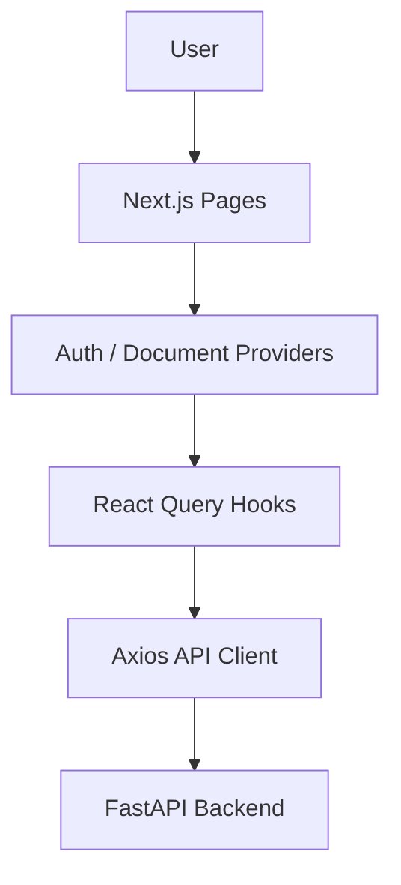
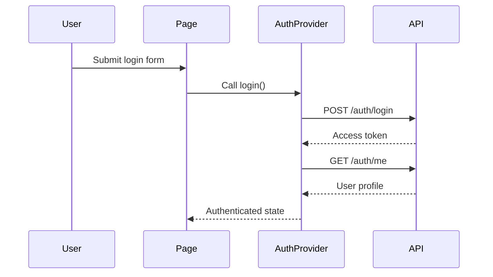
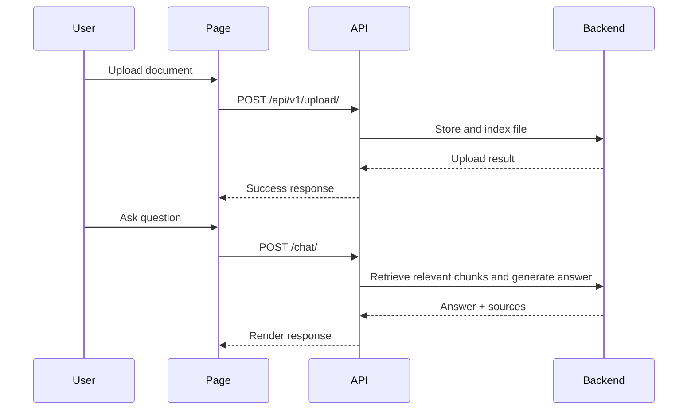

# AI Chat With PDF Client

   

This is the frontend for AI Chat With PDF, a modern web experience for signing in, uploading documents, and chatting with an AI assistant about uploaded content.

The client is built with Next.js and React, uses Tailwind CSS for styling, and integrates with the FastAPI backend through Axios and React Query.

## ✨ Features

- Responsive authentication pages for login and registration
- Protected routes for authenticated users
- Upload experience for document onboarding
- Chat interface for asking questions about uploaded documents
- Document list and selection flow
- Theme switching support
- Server-state management with React Query
- Clean UI components built with custom shadcn-style primitives

## 🏗️ Frontend Architecture



## 🧠 Beginner-Friendly Concepts

- React Query: A tool that helps the app fetch, cache, and refresh server data in a predictable way.
- Context API: A built-in React feature for sharing state such as authentication and the currently selected document across the app.
- JWT: The browser stores a signed token after login so protected requests can be authenticated later.
- Semantic Search: The backend finds relevant document chunks by meaning rather than exact words.
- Chunking: Large documents are broken into smaller parts to make retrieval and answering more precise.

## 📁 Folder Structure

| Folder      | Responsibility                                              |
| ----------- | ----------------------------------------------------------- |
| app/        | Route-level pages such as login, register, upload, and chat |
| components/ | Reusable UI pieces for layout, chat, upload, and auth       |
| providers/  | Global state providers for auth and the active document     |
| hooks/      | Custom hooks for data fetching and mutations                |
| services/   | API service wrappers for auth, upload, chat, and documents  |
| lib/        | Shared client utilities such as Axios configuration         |
| types/      | TypeScript models used across the app                       |
| public/     | Static assets                                               |

## 🛠️ Technology Stack

| Technology      | Purpose                                  |
| --------------- | ---------------------------------------- |
| Next.js 16      | App router and server/client rendering   |
| React 19        | UI rendering and component model         |
| TypeScript      | Type-safe frontend development           |
| Tailwind CSS    | Utility-first styling                    |
| Framer Motion   | Lightweight animations                   |
| next-themes     | Theme toggling                           |
| Axios           | HTTP client for backend requests         |
| React Query     | Server state caching and synchronization |
| React Hook Form | Form handling                            |
| Zod             | Schema-based validation                  |
| react-markdown  | Markdown rendering in the chat UI        |
| Sonner          | Toast notifications                      |

## 📄 Pages

| Page      | Purpose                                       |
| --------- | --------------------------------------------- |
| /         | Landing page                                  |
| /login    | User login                                    |
| /register | New account registration                      |
| /upload   | Document upload and recent document selection |
| /chat     | Chat interface for the selected document      |

## 🧩 Components and Providers

- Components are organized by feature area: auth, chat, layout, upload, and UI primitives.
- The auth provider manages login state and restores the JWT from local storage.
- The document provider tracks the currently selected document in the chat experience.
- Protected routes redirect unauthenticated users to the login page.

## ⚛️ React Query and State Flow

React Query is used to manage server data such as the current user and the list of documents. The app uses cached queries and mutation invalidation so document changes refresh the UI smoothly.

The Context API is used for lightweight global state in the app:

- Authentication context for login, logout, and user persistence
- Document context for the active document selected in the chat flow

## 🔐 Authentication Flow



## 📤 Upload and Chat Flow



## 🔗 API Integration

The frontend communicates with the backend through a shared Axios client.

| Service         | Endpoint Area                           |
| --------------- | --------------------------------------- |
| authService     | /auth/register, /auth/login, /auth/me   |
| uploadService   | /api/v1/upload/                         |
| chatService     | /chat/                                  |
| documentService | /documents and /documents/{document_id} |

The client attaches the JWT from local storage to requests using an Axios request interceptor.

## 🌍 Environment Variables

Create a .env.local file in the client folder if you need to override the API endpoint.

| Environment Variable | Description                      |
| -------------------- | -------------------------------- |
| NEXT_PUBLIC_API_URL  | Base URL for the FastAPI backend |

### Sample .env.local

```env
NEXT_PUBLIC_API_URL=http://localhost:8000
```

## ▶️ Running the Project

Install dependencies:

```bash
cd client
npm install
```

Start the development server:

```bash
npm run dev
```

Open the app at:

- http://localhost:3000

## 🧪 Available Scripts

```bash
npm run dev
npm run build
npm run start
npm run lint
```

## 🔭 Future Improvements

- Add richer loading and error states for upload and chat flows
- Improve accessibility and keyboard navigation
- Add pagination or filtering for large document lists
- Add more polished onboarding and empty states

## 🤝 Contributing

Contributions are welcome. Please describe the change clearly and keep the implementation aligned with the current architecture.

## 📄 License

No explicit license file is currently present in this repository. If you plan to distribute the project publicly, add a license file such as MIT or Apache-2.0.
